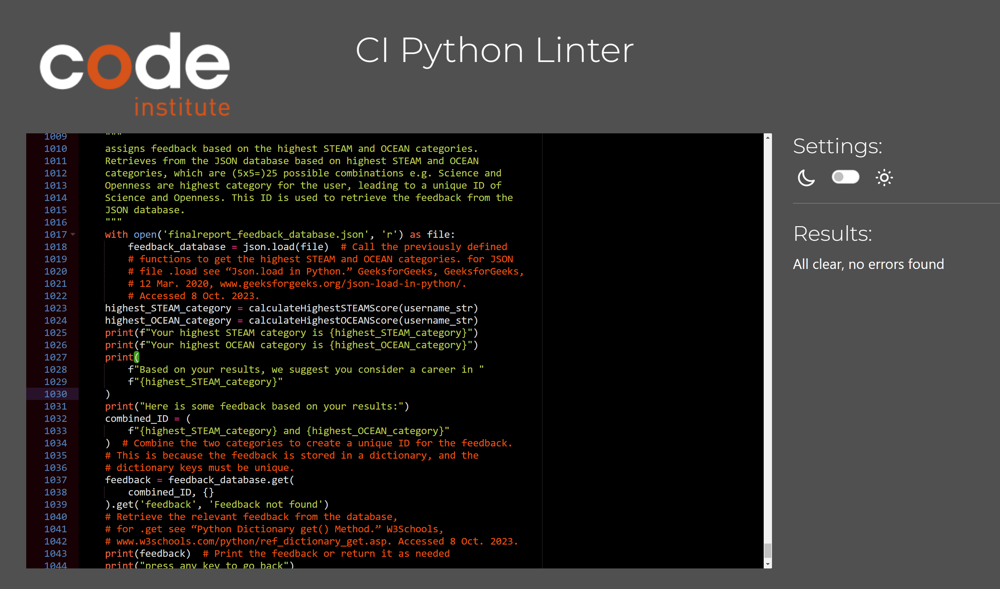
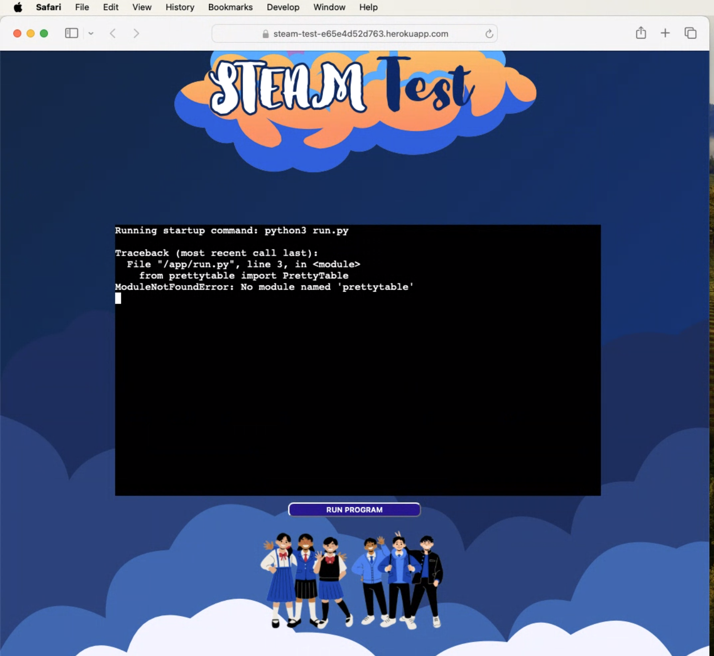
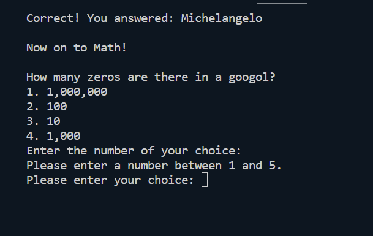
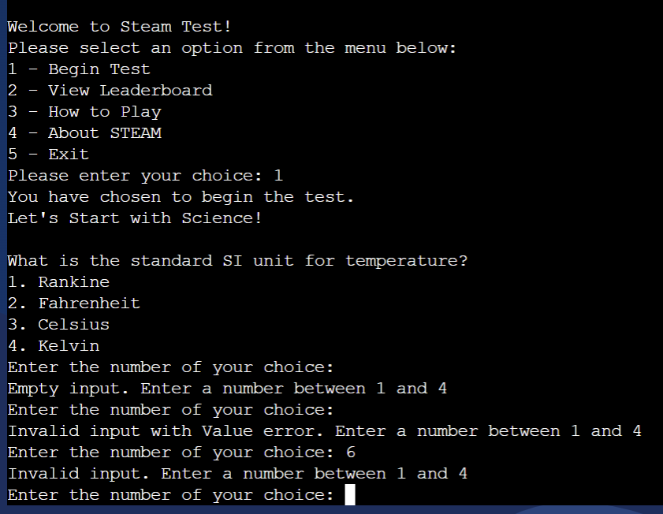
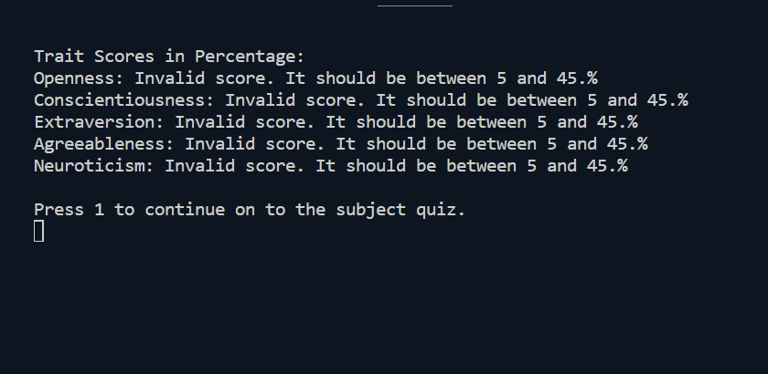
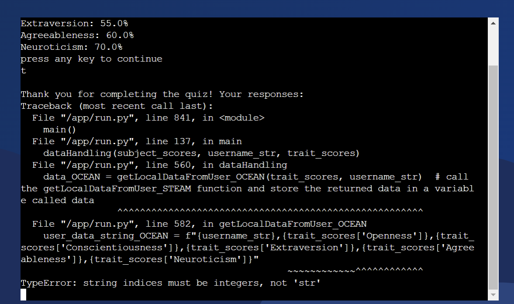

<div align="center">


# Steam Test: a fun cross-curricular quiz for students <!-- omit in toc -->

  

</div>

<div align=center></div><br>

This readme introduces the key features of the project, using the framework of the 5 planes of User Experience. It summarises key challenges addressed along the way and also provides credits and acknowledgesments at the end.

An [issues.md](https://github.com/lmcrean/Crocodile-Kingdom/blob/main/issues.md) file is dedicated to the most specific technical account of important issues and bugs that were researched and solved during the project.

<div align=center>

***Navigation Links:***<b>
[🌐click here to view Deployed Site ](https://steam-test-e65e4d52d763.herokuapp.com/)
</b>
</div>

## Table of Contents: <!-- omit in toc -->

<b>

[1. Outline of Features](#1-outline-of-features)<br>
[2. Manual Testing with the UX Development Planes](#2-ux-development-planes--manual-testing)<br>
[3. Automatic Testing & Deployment](#3-automatic-testing--deployment)<br>
[4. Issues and Bugs](#5-issues-and-bugs)<br>
[5. Credits & Acknowledgements](#6-credits--acknowledgements)

</br>
</b>

***

Full Table of Contents: <!-- omit in toc --></div>

- [1. Outline of Features](#1-outline-of-features)
  - [1.1. Feature 1](#11-feature-1)
- [2. Manual Testing with the UX Development Planes](#2-manual-testing-with-the-ux-development-planes)
  - [2.1. Strategy Plane](#21-strategy-plane)
    - [2.1.1. Developer Research](#211-developer-research)
    - [2.1.2. Initial Product Research](#212-initial-product-research)
    - [2.1.3. Project Timeline](#213-project-timeline)
    - [2.1.4. User Stories \& business goals](#214-user-stories--business-goals)
  - [I need a quiz that provides me with broader feedback that relates to other users.](#i-need-a-quiz-that-provides-me-with-broader-feedback-that-relates-to-other-users)
  - [2.2. Scope plane](#22-scope-plane)
    - [2.2.1. Mininum Viable Product features](#221-mininum-viable-product-features)
    - [2.2.2. Unique Selling Point features](#222-unique-selling-point-features)
    - [2.2.3. Scope of Features](#223-scope-of-features)
  - [2.3. Structure Plane](#23-structure-plane)
  - [2.4. Skeleton Plane](#24-skeleton-plane)
  - [2.5. Surface Plane](#25-surface-plane)
- [3. Automatic Testing \& Deployment](#3-automatic-testing--deployment)
  - [3.1. Validator Testing](#31-validator-testing)
  - [3.2. Lighthouse Report](#32-lighthouse-report)
  - [3.3. Browserstack Testing](#33-browserstack-testing)
  - [3.4. Deployment](#34-deployment)
- [4. Python Issues and Bugs](#4-python-issues-and-bugs)
  - [4.1. Cannot access OpenTrivia DB for Tech, Art and Maths.](#41-cannot-access-opentrivia-db-for-tech-art-and-maths)
  - [4.2. Issue with Enter key resetting game automatically](#42-issue-with-enter-key-resetting-game-automatically)
  - [4.3. Deployed Heroku does not recognise Windows-only ```msvcrt.getch()``` module from issue 2.](#43-deployed-heroku-does-not-recognise-windows-only-msvcrtgetch-module-from-issue-2)
  - [4.4. Series of Error messages on Heroku after seperating into package files and using from... import... syntax:](#44-series-of-error-messages-on-heroku-after-seperating-into-package-files-and-using-from-import-syntax)
  - [4.5. Tracing Terminal issues on the](#45-tracing-terminal-issues-on-the)
- [5. Credits \& Acknowledgements](#5-credits--acknowledgements)
  - [5.1. Initial Resources Research](#51-initial-resources-research)
  - [5.2. Code snippets](#52-code-snippets)
  - [5.3. Technologies Used](#53-technologies-used)
  - [5.4. Libraries Used](#54-libraries-used)
  - [5.5. Acknowledgements](#55-acknowledgements)

<div align=center></div>
<div align="center">

# 1. Outline of Features

## 1.1. Feature 1
</div>


<div align=center>


# 2. Manual Testing with the UX Development Planes

</div>

**The 5 UX development planes were used as an efficient framework for documenting the project's intentions.** 


**Manual testing focused on the functionality of the JS logic and CSS visuals:**

Using the latter 3 UX Planes as a guideline:
- **For the Structure plane, JS logic and HTML hyperlinks** functionality within each feature, using console.log() to check that the code was running as expected.
- **For the Skeleton plane, CSS positioning and responsivity to viewport width**, key breakpoints being at mobile view, tablet view (768px), laptop view (1208px) and desktop view (1728px+). 
- **For the Surface plane, design choices through vector graphics, typography, color and sound** that serve the user stories and elicit a positive emotional response. CSS was the key programming language and Canva was used for rendering graphic illustrations.

<div align=center>

## 2.1. Strategy Plane

The Strategy plane set the intention of $$$$$$$$$$$$$$$$$$$$$$$$ that would be developed over 5 weeks.

</div>


### 2.1.1. Developer Research

[↑ Back to top](#Steam-Test)

***

### 2.1.2. Initial Product Research
Initial Product research is credited in the [Credits and Acknowledgements section](#5-credits--acknowledgements).

[↑ Back to top](#Steam-Test)

***

### 2.1.3. Project Timeline

The 6 week timeline used the Agile method of interations and priorities. Todoist was chosen as the project management tool for it's simplicity and efficiency.

$$$$$$$$$$$$$$$$$$$$$$$$$$$$$$$$$$screen shot of todoist 

[↑ Back to top](#Steam-Test)

***

### 2.1.4. User Stories & business goals

The business goals were to provide users with a fun and engaging quiz that would promote careers in STEAM. The user stories were developed to meet the business goals.

<div align="center"><h3> User Stories testing</h3>


 </div>

**Business stories**
I need to promote Careers in STEAM

I need to use CRUD logic

I need footers at the bottom to promote my brand

**User Stories Scope**
I need a quiz that provides me with personal feedback on a certain holistic level.
 - the user takes a personality quiz at the beginning of the session.
 - the user takes a quiz on STEAM subjects.
 - the user receives a personal report at the end of the session, summarising their personality, academic knowledge and suggesting what qualities they might have for a career in STEAM.

I need a quiz that provides me with broader feedback that relates to other users.
  -

I want option to retake the quiz or delete my results.

I need my identity to be anonymous as there is sensitive data being handled
 - the user is asked to enter a username at the beginning of the session.
 - the user is asked to use a Moniker, and is double checked to confirm that their input is not their real name.

**Structure**
I need all the controls to navigate the test successfully

I need the quiz to show me my overall STEAM high score and assess my high score on individual sections.

I need to see my rank in the leaderboard. (If I completed the quiz faster than a user of the same rank, I deserve to be a higher rank)

I need each section to select 10 random MCQs from a large database

**Skeleton needs**
I need to see the logo consistently throughout the game

I need to track my high score throughout the game

I need the all the text to fit in the 80 by 80 box

**Surface needs**
I would like to see a ASCII decorated logo

I would like to have my terminal centered with a background


<div align=center></div>

## 2.2. Scope plane

It was important to choose a project that was achievable in the time frame, and that had a lot of resources available.

The project was researched, conceived and designed in 6 weeks. Important limitations of the project had to be set from the outset such as
- **Developing the Mininum Viable Product and Unique Selling Point simultaeneously.** This way, the essential product would be met in time with the deadline, and the unique features would keep me motivated.

[↑ Back to top](#Steam-Test)

<div align=center></div>

### 2.2.1. Mininum Viable Product features

A mininum viable product is a product with just enough features to satisfy early customers, and to provide feedback for future development.

<i>
The minumum viable product was

- a navigation menu with START, HIGH SCORES and HOW TO PLAY
- a quiz with 10 questions per section
- 5 sections of questions on Science, Technology, Engineering, Arts and Mathematics. From a database of 50 questions per section.
- a high score with a username, score, timestamp and rank. 
- option to restart the quiz
- open-close information about careers in STEAM

</i>

***


### 2.2.2. Unique Selling Point features

The unique selling point features were designed to meet the needs of new players, and to make the game more engaging and fun.

<i>
- Personality report with a unique personality type for each player, suggests what career the student might enjoy.
- Gambling game that reveals student's attitude to risk
</i>

[↑ Back to top](#Steam-Test)

***

### 2.2.3. Scope of Features

The full scope and function of features is discussed in the opening [Features](#1-features) section.

[↑ Back to top](#Steam-Test)

<div align=center></div>

## 2.3. Structure Plane

This Structure plane summarises the structure of each feature by highlighting most essential HTML, CSS and JS functions for the feature to work. The developer also used this as a workflow for drafting in the features.

***

Leaderboard flowchart

<div align=center></div>

[↑ Back to top](#Steam-Test)

<div align=center></div>

## 2.4. Skeleton Plane

The skeleton plane covers the layout of the website, and the responsiveness to viewport width.

[↑ Back to top](#Steam-Test)

<div align=center></div>

## 2.5. Surface Plane
This surface plane describes the choice of typefaces, colors and style themes relevant to the project's desired tone and practical needs.

[↑ Back to top](#Steam-Test)

<div align=center>

# 3. Automatic Testing & Deployment


</div>

The Automatic Testing achieved
- xxxxxxxxxxxxxxx
- xxxxxxxxxxxxx
- xxxx

[↑ Back to top](#Steam-Test)

***

## 3.1. Validator Testing

](https://img.shields.io/badge/PEP8_(Code_Institute_Version)-passed-green?style=for-the-badge&logo=python&color=green&logoColor=green)

The Validator used was the Code Institute PEP8 Python Linter. https://pep8ci.herokuapp.com/

While this was the main validator used, the developer also used the following validators to check the code:

- PyLint for quickly spotting long lines of code and other errors. https://www.pylint.org/




[↑ Back to top](#Steam-Test)


***

## 3.2. Lighthouse Report

To check the lighthouse report on a chrome browser, right click inspect and click on the lighthouse tab.

| | Home Page |
|---|---|
| Mobile |   | 
| Desktop |  | 
|Timestamp|  |

[↑ Back to top](#Steam-Test)


***

## 3.3. Browserstack Testing

https://www.browserstack.com/

testing on different browsers: there seems to be an issue with the logo falling above the navigation bar on the home page in Safari/iOS



[↑ Back to top](#Steam-Test)

<div align=center>

## 3.4. Deployment

</div> 

The project was deployed on Heroku. The following steps were taken:

1. Create a new app on Heroku
2. Add the following buildpacks in the following order:
    1. heroku/python
    2. heroku/nodejs
3. Connect the app to the Github repository
4. Deploy the app


[↑ Back to top](#Steam-Test)

<div align=center>

# 4. Python Issues and Bugs


</div>

## 4.1. Cannot access OpenTrivia DB for Tech, Art and Maths.
<div align=center><details><summary><b> click here to view the issue output</summary></b>


</details></div>

Under "Now on to Art!" and "Now on to Math!" it should reveal the quiz. Should also work for an earlier technology section.

It works for Science and English.

This is likely because the OpenTrivia DB API not active for the specific category.

**Solution: Removed Easy difficulty.**


<div align=center><details><summary><b> click here to view the solution output</summary></b>


here's the second attempt: we can see that the quiz is shuffling questions,making it exciting for the user.


</details></div>

In long term, best solution would be to migrate to local JSON database, as json files are saved.

## 4.2. Issue with Enter key resetting game automatically
<div align=center><details><summary><b> click here to view the issue output</summary></b>


pressing enter resets the game, hence why the player is being asked to enter a number between 1 and 5.
</details></div>


Sources consulted:
- still, Somebody. “Raw_input without Pressing Enter.” Stack Overflow, 19 Aug. 2010, stackoverflow.com/questions/3523174/raw-input-without-pressing-enter. Accessed 28 Sept. 2023.
- “Msvcrt — Useful Routines from the MS VC++ Runtime.” Python Documentation, 2023, docs.python.org/3/library/msvcrt.html#msvcrt.getch. Accessed 28 Sept. 2023.
- “Python String Decode() Method.” Tutorialspoint.com, 2022, www.tutorialspoint.com/python/string_decode.htm. Accessed 28 Sept. 2023.
- Pankaj. “Python ValueError Exception Handling Examples.” Digitalocean.com, DigitalOcean, 3 Aug. 2022, www.digitalocean.com/community/tutorials/python-valueerror-exception-handling-examples. Accessed 28 Sept. 2023.
- “2. Lexical Analysis.” Python Documentation, 2017, docs.python.org/3/reference/lexical_analysis.html#:~:text=Bytes%20literals%20are%20always%20prefixed,must%20be%20expressed%20with%20escapes. Accessed 28 Sept. 2023.


‌Solution: Imported and used ```msvcrt.getch()``` to get input from user without pressing enter.‌ Consulted [Python Documentation](python.org/3/library/msvcrt.html#msvcrt.getch).


‌

<div align=center><details><summary><b> click here to view the solution output</summary></b>

GIF:


</details></div> 

Programme ignores user pressing enter, and responds immediately to user input.

## 4.3. Deployed Heroku does not recognise Windows-only ```msvcrt.getch()``` module from issue 2. 


likely

Tried this solution:
- “Getch()-like Unbuffered Character Reading from Stdin on Both Windows and Unix «Python Recipes «ActiveState Code.” Activestate.com, 2023, code.activestate.com/recipes/134892-getch-like-unbuffered-character-reading-from-stdin/. Accessed 28 Sept. 2023.

‌still did not find getch

‌Solution: Removed ```msvcrt.getch()``` and replaced with ```input()```.‌


<div align=center><details><summary><b> click here to view the solution output</b></summary>



</details></div> 

The code now runs without error on Heroku, and although UX is a little unnessesary, enter key issue is resolved.

## 4.4. Series of Error messages on Heroku after seperating into package files and using from... import... syntax:

```
Running startup command: python3 run.py

Traceback (most recent call last):
  File "/app/run.py", line 10, in <module>
    from package_python import subjectquiz
  File "/app/package_python/subjectquiz.py", line 10, in <module>
    import run
  File "/app/run.py", line 11, in <module>
    from package_python import quizleaderboard
  File "/app/package_python/quizleaderboard.py", line 1, in <module>
    from package_python import finalreport
  File "/app/package_python/finalreport.py", line 1, in <module>
    from package_python import personality
  File "/app/package_python/personality.py", line 10, in <module>
    from prettytable import PrettyTable
ModuleNotFoundError: No module named 'prettytable'
```

**1. used . syntax to reference correct file.**
```python
from package.subjectquiz import subjectQuiz
from package.quizleaderboard import quizleaderboard
```
Output:
```console
You have chosen to begin the test.
we have reached the final report!
Question 1:
I take on responsibilities at work and complete tasks on time. In the future, I could successfully lead a project team and meet all project milestones, feeling accomplished and reliable.
Please enter a number from 1 to 9 (1 = Strongly Disagree, 5 = Neutral, 9 = Strongly Agree): 
```
I'm expecting the code to run the main menu, but it's running the final report. This is because the code is referencing the wrong file.

2. Transferred code from personality.py to run.py


Sources consulted:
“The Import Statements in Python.” Tutorialspoint.com, 2020, www.tutorialspoint.com/the-import-statements-in-python#:~:text=Python%27s%20from%20statement%20lets%20you,from%20fib%20import%20fibonacci. Accessed 7 Oct. 2023.
“Python Packages (with Examples).” Programiz.com, 2023, www.programiz.com/python-programming/package. Accessed 7 Oct. 2023.

1. currently displaying error with Prettytable
Heroku:
```console
Traceback (most recent call last):
  File "/app/run.py", line 12, in <module>
    from prettytable import PrettyTable
ModuleNotFoundError: No module named 'prettytable'
```
solved initially with subprocess:
DavidMuller. “How to Use Subprocess to Run External Programs in Python 3.” Digitalocean.com, DigitalOcean, 30 July 2020, www.digitalocean.com/community/tutorials/how-to-use-subprocess-to-run-external-programs-in-python-3. Accessed 7 Oct. 2023.

```‌python
subprocess.check_call([sys.executable, "-m", "pip", "install", "prettytable"])
```
‌
4. doesn't transition to next section
‌
solution: removed package and converted to single file on run.py


## 4.5. Tracing Terminal issues on the 
VSCode terminal:




```python
Traceback (most recent call last):
  File "/app/run.py", line 841, in <module>
    main()
  File "/app/run.py", line 137, in main
    dataHandling(subject_scores, username_str, trait_scores)
  File "/app/run.py", line 560, in dataHandling
    data_OCEAN = getLocalDataFromUser_OCEAN(trait_scores, username_str)  # call the getLocalDataFromUser_STEAM function and store the returned data in a variable called data
                 ^^^^^^^^^^^^^^^^^^^^^^^^^^^^^^^^^^^^^^^^^^^^^^^^^^^^^^
  File "/app/run.py", line 582, in getLocalDataFromUser_OCEAN
    user_data_string_OCEAN = f"{username_str},{trait_scores['Openness']},{trait_scores['Conscientiousness']},{trait_scores['Extraversion']},{trait_scores['Agreeableness']},{trait_scores['Neuroticism']}"
                                               ~~~~~~~~~~~~^^^^^^^^^^^^
TypeError: string indices must be integers, not 'str'
```

```
Trait Scores in Percentage:
Openness: Invalid score. It should be between 5 and 45.%
Conscientiousness: Invalid score. It should be between 5 and 45.%
Extraversion: Invalid score. It should be between 5 and 45.%
Agreeableness: Invalid score. It should be between 5 and 45.%
Neuroticism: Invalid score. It should be between 5 and 45.%
press any key to continue
```

Error with order
```---------Section: Art---------

--------Question 1 of 10---------

$$$ End of function
Now on to Math!

You have chosen to begin the multiple choice quiz.
What is the derivative of Acceleration with respect to time?
1. Shift
2. Bump
3. Jerk
4. Slide
Enter the number of your choice: 
```

```
Traceback (most recent call last):
  File "C:\Users\lmcre\OneDrive\Documents\GitHub\Project-3-Working-Title\run.py", line 827, in <module>

    ^
  File "C:\Users\lmcre\OneDrive\Documents\GitHub\Project-3-Working-Title\run.py", line 134, in main
    start_personality_quiz(username_str)
  File "C:\Users\lmcre\OneDrive\Documents\GitHub\Project-3-Working-Title\run.py", line 190, in start_personality_quiz
    start_subject_quiz(username_str, trait_scores)
  File "C:\Users\lmcre\OneDrive\Documents\GitHub\Project-3-Working-Title\run.py", line 196, in start_subject_quiz
    start_data_handling(username_str, trait_scores, subject_scores)
  File "C:\Users\lmcre\OneDrive\Documents\GitHub\Project-3-Working-Title\run.py", line 199, in start_data_handling
    dataHandling(username_str, trait_scores, subject_scores) # Upload the user's data to Google Sheets
    ^^^^^^^^^^^^^^^^^^^^^^^^^^^^^^^^^^^^^^^^^^^^^^^^^^^^^^^^
  File "C:\Users\lmcre\OneDrive\Documents\GitHub\Project-3-Working-Title\run.py", line 536, in dataHandling

  File "C:\Users\lmcre\OneDrive\Documents\GitHub\Project-3-Working-Title\run.py", line 549, in getLocalDataFromUser_STEAM
    data_STEAM = getLocalDataFromUser_STEAM(subject_scores, username_str)  # call the getLocalDataFromUser_STEAM function and store the returned data in a variable called data
                                                   ^^^^^^^^^^^^^^^^^^^^^^^^^
AttributeError: 'str' object has no attribute 'scoreTotal'
```


[↑ Back to top](#Steam-Test)

<div align=center>


# 5. Credits & Acknowledgements

</div>

## 5.1. Initial Resources Research

In early stages of development, the following python projects were tested and researched to gain an understanding of Python and find inspiration for an original project.

<details><summary><b> click here to view initial research and inspiration </b></summary>
<br><br>

**Python Projects:**
- “Tomdu3/Millionaire-Kindof: CI Project 3 - Who Wants to Be a Millionaire. Kind Of.” GitHub, 18 Mar. 2023, github.com/tomdu3/millionaire-kindof. Accessed 17 Sept. 2023.
  - username with validation check
  - decorated with title displays constantly, ASCII art, fast animations
  - navigation menu including how to play, high scores
  - points guaranteed constantly displays and updates
  - connects to a Google Sheet and updates the high scores
  - uses the Trivia API “The Trivia API | the Internet’s Largest Database of Multiple Choice Quiz Questions.” The-Trivia-Api.com, 2023, the-trivia-api.com/. Accessed 17 Sept. 2023.

- “Rockroman/PP3_The_Coach.” GitHub, 7 Oct. 2022, github.com/rockroman/PP3_The_Coach. Accessed 17 Sept. 2023.
  - presents data as a table after collecting user data
  - calculates a % score based on data

- “Beratzorlu/Python-Quiz: Code Institute Prof. Dip. Full Stack Software Development Portfolio Project 3: A CLI-Based Quiz Game.” GitHub, 2023, github.com/beratzorlu/python-quiz. Accessed 17 Sept. 2023.
  - quiz logic with validation check and a database
  - score logic
  - science question
  - user name with validation check
  - decorated with colors and ASCII art

- “Alexkisielewicz/Home-Library-App: Home Library App Was Created as Portfolio Project #3 (Python Essentials) for Diploma in Full Stack Software Development at Code Institute.” GitHub, 20 Nov. 2022, github.com/alexkisielewicz/home-library-app. Accessed 17 Sept. 2023.
  - advanced CRUD logic 
  - displays tables
  - changes sorting method

- “Jkingportfolio/CI_PP3_Taco_Trailer: Code Institute Full Stack Developer Course - Portfolio Project 3 - Python Essentials.” GitHub, 15 Sept. 2022, github.com/jkingportfolio/CI_PP3_Taco_Trailer. Accessed 17 Sept. 2023.

**Walkthroughs:**
- “Code-Institute-Solutions/Love-Sandwiches-P5-Sourcecode.” GitHub, 25 Mar. 2021, github.com/Code-Institute-Solutions/love-sandwiches-p5-sourcecode. Accessed 17 Sept. 2023. 
  - Shows how to connect to a Google Sheet
  - Creates a formula for calculating the data on different sheets
  - Shows how to deny invalid input
  - How to structure code with Main() function and other functions
  - Experimented with the code to see how python could recognise the data in the Google Sheet, regardless of whether it was a calculated formula or not.
  
  <details><summary>Tested some basic CSS decorations, click here to view</summary>
  
  ```css
    body {
    background-image: url(https://i.ibb.co/fSD71Nb/endless-constellation.png);/*Todo: try hosting the image locally on github*/
    background-size: 300px;
    background-repeat: repeat;
    background-attachment: fixed;
    display: flex;
    justify-content: center;
    align-items: center;
    flex-direction: column;
    height: 100vh;
    }
  ```

  </details>
- Run That. “Quiz App Using API Data - Python Project 💥 Make a Python Quiz App.” YouTube, YouTube Video, 16 May 2023, www.youtube.com/watch?v=kW2f1Hwgals. Accessed 17 Sept. 2023.
  - how to use OpenTriviaDB API

**Personality Quiz Resources**
- “Methodology - Sentino Personality API - Psychology NLP.” Sentino Personality API - Psychology NLP, 2 Oct. 2023, sentino.org/api/methodology/#2-1-golden-data-set. Accessed 5 Oct. 2023.
- Real Python. “Build a Quiz Application with Python.” Realpython.com, Real Python, 8 June 2022, realpython.com/python-quiz-application/#step-1-ask-questions. Accessed 5 Oct. 2023.
- Guest. “The Myers Test - PDFCOFFEE.COM.” Pdfcoffee.com, PDFCOFFEE.COM, 2021, pdfcoffee.com/the-myers-test-pdf-free.html. Accessed 5 Oct. 2023.
- 
‌
‌

**Python Libraries**

- “Prettytable.” PyPI, 11 Sept. 2023, pypi.org/project/prettytable/. Accessed 21 Sept. 2023.
- “Colorama.” PyPI, 25 Oct. 2022, pypi.org/project/colorama/. Accessed 21 Sept. 2023.

‌
**Automatic Testing Resources**
- “CI Python Linter.” Herokuapp.com, 2023, pep8ci.herokuapp.com/. Accessed 21 Sept. 2023.

**Databases**
- “Open Trivia DB.” Opentdb.com, 2023, opentdb.com/. Accessed 17 Sept. 2023.
  - this is the API used in the walkthrough above
  - it has a lot of categories and questions
- “The Trivia API | the Internet’s Largest Database of Multiple Choice Quiz Questions.” The-Trivia-Api.com, 2023, the-trivia-api.com/. Accessed 17 Sept. 2023.
- Personal Marksheet Database. Accessed 21 Sept 2023.
  - this is a database that I created at a previous school to calculate student data. The feedback updates according to the data entered, assuming and identifying the most urgent areas to improve.
  - The subject matter of an Art Test is a little problematic undermines cultural enrichment aspect of the subject. 
  - Contains "Free School Meals", Special Needs and English as an Additional Language Data which is useful.
  - Could it be resummarised as a more objective test?
  - Could it be an essential prompt that the success criteria is defined by the user with 6 criteria? Then use the existing data as dummy data. Then allow the user to create their own data.


**Surface Design**
- “Create ASCII Text Banners Online.” Manytools.org - Your Online Toolshed, 2022, manytools.org/hacker-tools/ascii-banner/. Accessed 17 Sept. 2023.

**Other**
- nevsky.programming. “Top 5 Most Useful Python Libraries #Shorts.” YouTube, YouTube Video, 29 July 2021, www.youtube.com/shorts/1hFq8EdQpqM. Accessed 21 Sept. 2023.
- “Code Institute Curriculum.” Codeinstitute.net, 2023, learn.codeinstitute.net/ci_program/diplomainfullstacksoftwarecommoncurriculum. Accessed 21 Sept. 2023. Available to students only.

‌

‌</details>

## 5.2. Code snippets


[↑ Back to top](#Steam-Test)


## 5.3. Technologies Used

**Languages**
- [Python](https://www.python.org/) was used as the backend programming language

**Programming Software**
- [VSCode](https://code.visualstudio.com/) was used as my code editor
- [Gitpod](https://www.gitpod.io/) was used as my secondary code editor
- [Github](https://www.github.com/) was used for Version control

**General Software**


**Tools**


[↑ Back to top](#Steam-Test)

***

## 5.4. Libraries Used

**Programming Libraries**


**Media libraries**
- [canva](https://www.canva.com/) was used for the vector graphics in the Readme, the logo and favicon
- [bgjar](https://bgjar.com/) was used for the background image in the Readme

**Fonts**


***


‌

‌


## 5.5. Acknowledgements


[↑ Back to top](#Steam-Test)

<div align=center><br><br></div>

</div>
