<div align="center">


# Steam Report: personalised insights and career recommendations for young students <!-- omit in toc -->

 

    

 ](https://img.shields.io/badge/CI_Python_Linter_(PEP8)-passed-green?style=for-the-badge&logo=python&color=brightgreen&logoColor=white)

</div>

<div align=center></div><br>


This readme introduces the key features of the project, while summarising key the most important processes addressed along the way. It also provides credits and acknowledgesments at the end.

Manual Testing with the UX Development Planes


<div align=center>

***Navigation Links:***<b>
[🌐click here to view Deployed Site ](https://steam-report-4c5b92c32ae5.herokuapp.com/)
</b>
</div>

## Table of Contents: <!-- omit in toc -->

<b>

- [1. Outline of Features](#1-outline-of-features)
- [2. Manual Testing with the UX Development Planes](#2-ux-development-planes--manual-testing)
- [3. Automatic Testing & Deployment](#3-automatic-testing--deployment)
- [4. Issues and Bugs](#5-issues-and-bugs)
- [5. Credits & Acknowledgements](#6-credits--acknowledgements)

</br>
</b>

***

Full Table of Contents: <!-- omit in toc --></div>

- [1. Outline of Features](#1-outline-of-features)
  - [1.1. Menu](#11-menu)
  - [1.2. Personality Quiz (OCEAN Big 5 Personality Traits)](#12-personality-quiz-ocean-big-5-personality-traits)
  - [1.3. Personality Quiz Results](#13-personality-quiz-results)
  - [1.4. Subject Quiz (STEAM = Science, Technology, English, Art, Math)](#14-subject-quiz-steam--science-technology-english-art-math)
  - [1.5. Personalised Report](#15-personalised-report)
  - [1.6. Leaderboard](#16-leaderboard)
  - [1.7. Accessibility Features](#17-accessibility-features)
  - [1.8. Delete Data](#18-delete-data)
  - [1.9. Validation Loops](#19-validation-loops)
- [2. Manual Testing with the UX Development Planes](#2-manual-testing-with-the-ux-development-planes)
  - [2.1. Strategy Plane](#21-strategy-plane)
    - [2.1.1. User Stories \& business goals](#211-user-stories--business-goals)
    - [2.1.2. Initial Product Research](#212-initial-product-research)
    - [2.1.3. Project Timeline](#213-project-timeline)
  - [2.2. Scope plane](#22-scope-plane)
    - [2.2.1. Mininum Viable Product features](#221-mininum-viable-product-features)
    - [2.2.2. Unique Selling Point features](#222-unique-selling-point-features)
    - [2.2.3. Scope of Features](#223-scope-of-features)
  - [2.3. Structure Plane](#23-structure-plane)
    - [2.3.1. Control Flow Diagram](#231-control-flow-diagram)
  - [2.4. Skeleton Plane](#24-skeleton-plane)
    - [2.4.1. Code Structure](#241-code-structure)
  - [2.5. Surface Plane](#25-surface-plane)
- [3. Automatic Testing \& Deployment](#3-automatic-testing--deployment)
  - [3.1. Validator Testing](#31-validator-testing)
  - [3.2. Lighthouse Report](#32-lighthouse-report)
  - [3.3. Browserstack Testing](#33-browserstack-testing)
  - [3.4. Deployment](#34-deployment)
    - [3.4.1. Github](#341-github)
    - [3.4.2. Heroku](#342-heroku)
- [4. Python Issues and Bugs](#4-python-issues-and-bugs)
  - [4.1. Cannot access OpenTrivia DB for Tech, Art and Maths.](#41-cannot-access-opentrivia-db-for-tech-art-and-maths)
  - [4.2. Solution abandoned: Issue with Enter key resetting game automatically](#42-solution-abandoned-issue-with-enter-key-resetting-game-automatically)
  - [4.3. Deployed Heroku does not recognise Windows-only ```msvcrt.getch()``` module from previous issue 4.2.](#43-deployed-heroku-does-not-recognise-windows-only-msvcrtgetch-module-from-previous-issue-42)
  - [4.4. Series of Error messages on Heroku after seperating into package files and using from... import... syntax:](#44-series-of-error-messages-on-heroku-after-seperating-into-package-files-and-using-from-import-syntax)
  - [4.5. Heroku Terminal doesn't recognise PrettyTable or termcolor modules.](#45-heroku-terminal-doesnt-recognise-prettytable-or-termcolor-modules)
  - [4.6. Tracing Terminal issues on the VSCode terminal:](#46-tracing-terminal-issues-on-the-vscode-terminal)
  - [4.7. 4.6 Finding correct parameters for functions](#47-46-finding-correct-parameters-for-functions)
- [5. Credits \& Acknowledgements](#5-credits--acknowledgements)
  - [5.1. Initial Resources Research](#51-initial-resources-research)
  - [5.2. Code snippets from Love Sandwiches and Quiz App walkthroughs.](#52-code-snippets-from-love-sandwiches-and-quiz-app-walkthroughs)
  - [5.3. Technologies Used](#53-technologies-used)
  - [5.4. Libraries Used](#54-libraries-used)
  - [5.5. Acknowledgements](#55-acknowledgements)

<div align=center></div>
<div align="center">

# 1. Outline of Features


The Page is presented with a logo and a hero image underneath the terminal. The colour scheme is themed blue with a Steam Motif to play on the idea of a Steam Report.

At the beginning the user is asked to enter a username, and is asked to confirm that their input is not their real name. This is to protect the user's identity, as the user is asked to input sensitive data.

## 1.1. Menu

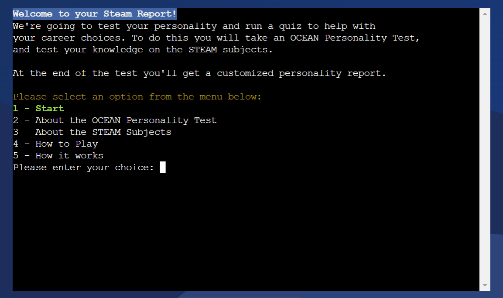

The main menu provides the user with several options, including taking the Personality Quiz, learning about the OCEAN Personality Test, participating in the STEAM Subject Quiz, and other useful information. Navigation is facilitated through numerical selections.

## 1.2. Personality Quiz (OCEAN Big 5 Personality Traits)

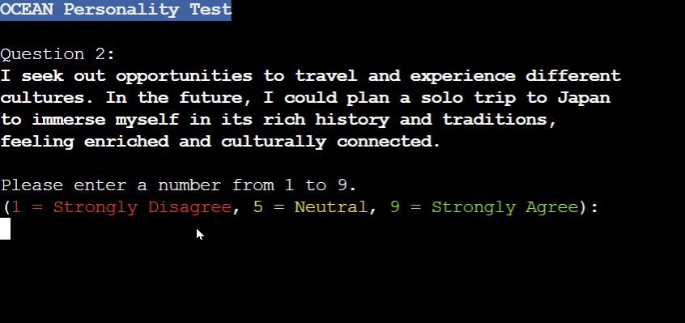

The Personality Quiz is designed to measure the Big 5 personality traits: Openness, Conscientiousness, Extraversion, Agreeableness, and Neuroticism (OCEAN). The user's responses are used to generate a personalised report to provide career guidance.

## 1.3. Personality Quiz Results

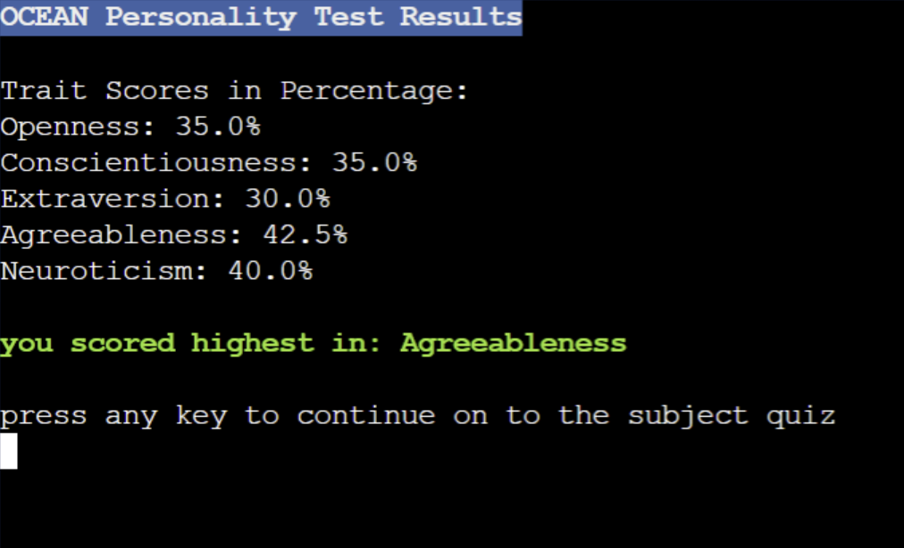

## 1.4. Subject Quiz (STEAM = Science, Technology, English, Art, Math)


The Subject Quiz focuses on STEAM subjects: Science, Technology, English, Art, and Math. This quiz aims to identify the user's strengths and weaknesses in these subjects, offering additional insights for career choices.

## 1.5. Personalised Report


Based on the results from the Personality and Subject Quizzes, a detailed report is generated. This report includes recommended career paths and environments that the user may excel in, tailored to their unique personality and skill set.


## 1.6. Leaderboard
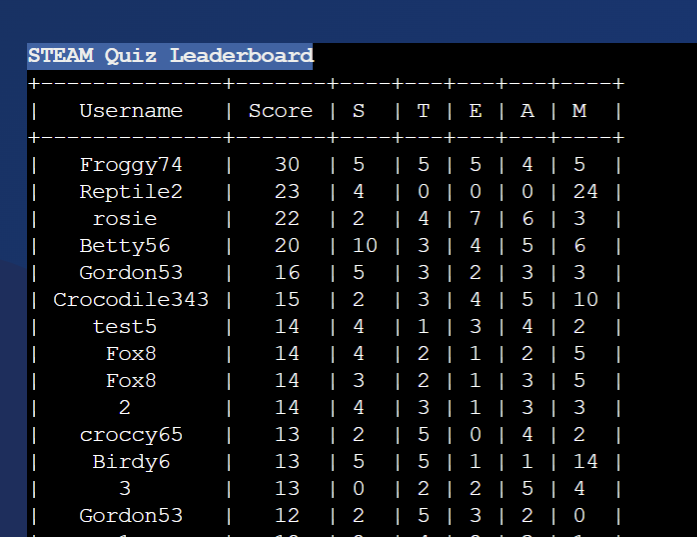

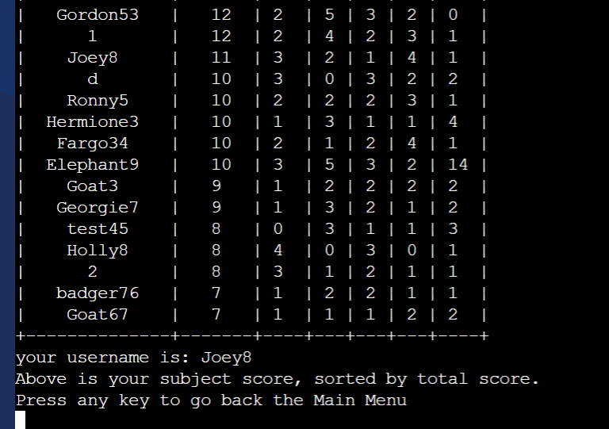

The leaderboard feature allows users to compare their scores with others. It adds a competitive element to the quizzes and encourages users to improve their scores.

## 1.7. Accessibility Features
The application is built with accessibility in mind, focusing on readability and color prompts.


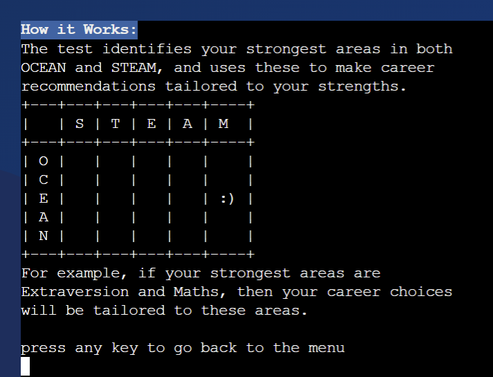

</div>

 - consistent headings for navigation
 - How To Play in the menu
 - color prompts with simple Red, Amber Green. For example the menu highlights start option, the personality quiz uses red, amber, green to indicate the user's options of disagree/neutral/agree, and the subject quiz uses red, amber, green to indicate the user's feedback of incorrect/correct.

## 1.8. Delete Data

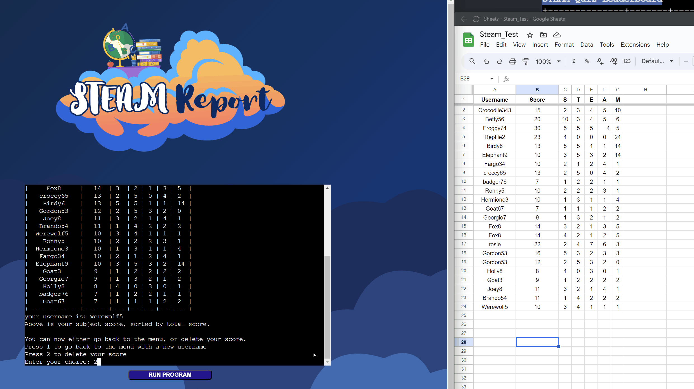

- at the end of the quiz, user has the option to delete their data from the database. This is to protect the user's privacy, and to ensure that the user's data is not stored unnecessarily.

## 1.9. Validation Loops

Validation loops are used to check that the following are entered correctly throughout the programme:
- username (3-9 characters)
- menu selection (User enters number between 1-5)
- personality quiz selection (User enters number between 1-9)
- subject quiz selection (User enters number between 1-4)
- delete data selection (User enters number between 1-2)

[↑ Back to top](#Steam-Report)

<div align=center>


# 2. Manual Testing with the UX Development Planes

</div>

**The 5 UX development planes were used as an efficient framework for documenting the project's intentions.** The planes were used to develop the project's strategy, scope, structure, skeleton and surface. The planes were also used to test the project's features and to document the process.

<div align=center>

## 2.1. Strategy Plane

The Strategy plane set the intention of a dynamic quiz that would be developed over 5 weeks.

</div>

[↑ Back to top](#Steam-Report)

***


### 2.1.1. User Stories & business goals

The business goals were to provide users with a fun and engaging quiz that would promote careers in STEAM. The user stories were developed to meet the business goals.

The users would be young students, who would be interested in learning about their personality and career options. These users were generally intended to be new users, who would use the platform once during a careers session at their school. 

<div align="center"><h3> User Stories testing</h3>


 </div>

**Business goals**

> **As the business, I need to promote Careers in STEAM**
- The quiz provides a fun and engaging way to learn about STEAM subjects, including personalised career suggestions based on the user's personality and skill set.
- The quiz explains the OCEAN Personality Test and STEAM subjects in an easy-to-understand way.

> **As the business, I need to promote my brand**
- The logo is displayed on the home page above the terminal, as well as in the favicon.
- The footer includes links to the developer's Github and LinkedIn profiles.

> **As the software developer, I need to use CRUD logic (Create, Read, Update, Delete) to manage the user's data.**
- The user can Create a new username and high score
- The user can Read the quiz questions and feedback efficiently with a clean design
- The score logic updates as the user progresses through the quiz
- The user has an option to Delete their data from the database at the end of the quiz.

**User Stories -- Scope**

> **As a new user, I need a quiz that provides me with personal feedback on a certain holistic level.**
 - the user takes a personality quiz at the beginning of the session.
 - the user takes a quiz on STEAM subjects.
 - the user receives a personal report at the end of the session, summarising their personality, academic knowledge and suggesting what qualities they might have for a career in STEAM.

> **As a new user, I need a quiz that provides me with broader feedback that relates to other users.**
 - the user is given a rank in the leaderboard, and is shown how many users have completed the quiz.
 - the user is told what rank they came in their most knowledgeable subject, in relation to other users. E.g. ```You came 5th in Science.```
 - the user is told what percentage they came in their strongest personality trait, in relation to other users. E.g. ```You scored in the top 20% for Openness.```

> **As a new user, I want option to retake the quiz**
- the user can easily navigate back to the menu

> **As a new user, I need to feel comfortable about my personality data being handled.**
 - the user is prompted to use an anonymous Moniker, and is double checked to confirm that their input is not their real name.
 - the purpose is clearly stated that the data is used to provide career feedback.

**User Stories -- Structure**

> **As a new user, I need all the controls to navigate the test successfully**

 - There are validation loops infused throughout the application, to ensure that the computer collects the correct data from the user.
 - The user is prompted to enter a username, which is validated to confirm it is 3-9 characters long. Rationale for this is the leaderboard display.
 - The user is prompted to enter a number from 1 to 5 to navigate the Menu
 - The user is prompted to enter a number from 1 to 9 on a scale of Strongly Disagree to Strongly Agree
 - The user is prompted to enter a number from 1 to 4 to complete the test

> **As a new user, I need the quiz to provide ongoing feedback, in order to keep me engaged.**
 - The user gets feedback on their overall personality traits at the end of the quiz.
 - The user can see their running score during the STEAM Quiz.
 - The user can see their overall results as describedin User Story ```I need a quiz that provides me with personal feedback on a certain holistic level.```

> **As a new user, I need the quiz to be dynamic, in order to keep me engaged.**
- the OCEAN Personality Test randomises the questions from a database of 25 questions
- the STEAM quiz select 10 random MCQs from a large API database

 **User Stories -- Skeleton**
> **As a new user, I need to see simple branding consistently throughout the application.**
- the logo is displayed on the home page above the terminal
- white on blue headings are used throughout the application

> **As a new user, I need the all the text to fit in the terminal box**
- the python code is never more than 79 characters long per line.
- line breaks are used where appropriate

> **As a new user, I want to get an idea of my progress through the subject quiz.**
- For the OCEAN Personality quiz, there is no "score" fed back until the end, so as not to influence the user's answers with a "right answer".
- For the STEAM quiz the user is told what question they are on, and their running score.

**User Stories -- Surface**

> **As a new user, I need the text to be readable and clear.**
- the white on blue heading at the top of the terminal ensures the user always knows where they are in the application.
- where appropriate the text is highlighted with color prompts, such as red, amber, green.

> **As a new user, I need to have the overall website design evoke a positive emotional response.**
- terminal is centered on the page
- the background is a blue cloud vector, playing with the steam motif.
- the logo is a steam motif, with bright colors and friendly cursive font
- the favicon is a globe, to represent the the global nature of STEAM careers, as well as a positive representation of education.
- the hero image below the terminal is a group of happy students, to represent the target audience of the application.


### 2.1.2. Initial Product Research
Initial Product research is credited in the [Credits and Acknowledgements section](#5-credits--acknowledgements). In summary, the developer researched quizzes and API walkthroughs to find a suitable project that would be achievable in the time frame.

[↑ Back to top](#Steam-Report)

***

### 2.1.3. Project Timeline

The 6 week timeline used the Agile method of iterations and priorities. Todoist was chosen as the project management tool for it's simplicity and efficiency.

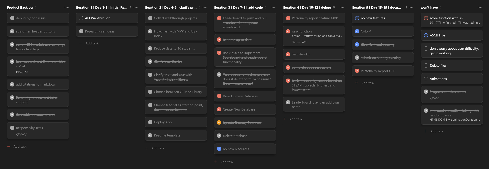

[↑ Back to top](#Steam-Report)

***


<div align=center></div>

## 2.2. Scope plane

It was important to choose a project that was achievable in the time frame, and that had a lot of resources available.

The project was researched, conceived and designed in 6 weeks. Important limitations of the project had to be set from the outset such as

- **Developing the Mininum Viable Product and Unique Selling Point simultaeneously.** This way, the essential product would be met in time with the deadline, and the unique features would keep me motivated. For the user, this strategy seemed the best option to guarantee a balance of both reliability and enjoyment.

[↑ Back to top](#Steam-Report)

<div align=center></div>

### 2.2.1. Mininum Viable Product features

A mininum viable product is a product with just enough features to satisfy early customers, and to provide feedback for future development.

The minumum viable product was:

<i>


- a navigation menu with START, HIGH SCORES and HOW TO PLAY
- a quiz with 10 questions per section
- 5 sections of questions on Science, Technology, Engineering, Arts and Mathematics. From a database of 50 questions per section.
- a high score with a username, score, timestamp and rank. 
- option to restart the quiz
- open-close information about careers in STEAM

</i>

***


### 2.2.2. Unique Selling Point features

The unique selling point features were designed to meet the needs of new players, and to make the game more engaging and fun.

The unique selling point features were:

<i>

- The STEAM Quiz is combined with a preceding personality quiz, to provide a more holistic report.
- The Data identifies the user's strongest personality trait, and their strongest subject.
- Personality report with a unique personality type for each player, suggests what career the student might enjoy.
- a PrettyTable is used to display the leaderboard, with a rank, username, score and timestamp.

</i>

[↑ Back to top](#Steam-Report)

***

### 2.2.3. Scope of Features

The full scope and function of features is discussed in the opening [Features](#1-outline-of-features) section.

[↑ Back to top](#Steam-Report)

<div align=center></div>

## 2.3. Structure Plane

This Structure plane summarises the structure of each feature by highlighting most essential HTML, CSS and JS functions for the feature to work. The developer also used this as a workflow for drafting in the features.

### 2.3.1. Control Flow Diagram

This control flow diagram summarises the structure of the application, and the flow of the user's journey through the application.

For a more accurate breakdown of the code, please refer to the inline documentation in ```run.py```.

***


***
<details><summary>click here to see Leaderboard flowchart (early draft)</summary>

<div align=center></div>

</details>

[↑ Back to top](#Steam-Report)

<div align=center></div>

## 2.4. Skeleton Plane

- The skeleton plane covers the layout of the website, and the responsiveness to viewport width.

- The website is desktop only. The terminal is centered on the page, and the hero image is below the terminal.

- The terminal is cleared after each question, and the user is prompted to press enter to continue.

```python
os.system('cls' if os.name == 'nt' else 'clear')
```

[↑ Back to top](#Steam-Report)

<div align=center></div>

### 2.4.1. Code Structure

Once the Quiz starts, the user is taken through the personality quiz, the subject quiz, the leaderboard, and finally the personality report, as illustrated in these functions.

Note how the username_str, trait_scores and subject_scores are carried through the parameters, towards the final report.

```python

# ------------------ Overall Structure of Quiz ------------------


"""
The user goes through the personality quiz,
the subject quiz and leaderboard,
then finally onto a personality report.
"""


def start_personality_quiz(username_str):
    """
    This function starts the personality quiz.
    username_str is carried through the function to the end.
    results are stored in trait_scores.
    At the end it is redirected to the subject quiz.
    """
    personality_quiz()  # start the personality quiz
    personalityResults(trait_scores)  # display the user's answers
    start_subject_quiz(username_str, trait_scores)


def start_subject_quiz(username_str, trait_scores):
    """
    This function starts the subject quiz.
    username_str and trait_scores are carried through
    the function to the end.
    results of quiz are stored in subject_scores.
    At the end it is redirected to the data handling section.
    """
    # initialize subject scores
    subject_scores = SubjectScore(0, 0, 0, 0, 0, 0)
    subjectQuiz(subject_scores)  # start the subject quiz
    start_data_handling(username_str, trait_scores, subject_scores)


def start_data_handling(username_str, trait_scores, subject_scores):
    """
    begins data handling section.
    username_str, trait_scores and subject_scores are carried
    through the parameters. The data is stored in the google sheet API.
    At the end it is redirected to the personality report.
    """
    dataHandling(username_str, trait_scores, subject_scores)
    start_personality_report(username_str, trait_scores, subject_scores)


def start_personality_report(username_str, trait_scores, subject_scores):
    """
    displays a final report, indicating best option.
    username_str, trait_scores and subject_scores are carried through.
    the final report
    """
    personalityReport(username_str, trait_scores, subject_scores)
    # Display the user's answers
```
  
  [↑ Back to top](#Steam-Report)


## 2.5. Surface Plane
This surface plane describes the choice of typefaces, colors and style themes relevant to the project's desired tone and practical needs.

- The HTML/CSS Design choices are displayed in the [Features](#1-outline-of-features) section. 
- The color scheme is blue, with a steam motif.
- The logo font used is ```Bloom Skirt``` and was designed by the developer using [Canva.](https://www.canva.com/)
- The background is a blue cloud vector, acquired using [bgjar.com](https://bgjar.com/).

[↑ Back to top](#Steam-Report)

<div align=center>

# 3. Automatic Testing & Deployment


</div>

The Automatic Testing refered to the automated testing of the code, and the deployment of the code to Heroku.

[↑ Back to top](#Steam-Report)

***

## 3.1. Validator Testing

](https://img.shields.io/badge/CI_Python_Linter_(PEP8)-passed-green?style=for-the-badge&logo=python&color=green&logoColor=green)

The Validator used was the Code Institute PEP8 Python Linter. https://pep8ci.herokuapp.com/

While this was the main validator used, the developer also used the following validators to check the code:

- PyLint for quickly spotting long lines of code and other errors. https://www.pylint.org/


[↑ Back to top](#Steam-Report)


***

## 3.2. Lighthouse Report

To check the lighthouse report on a chrome browser, right click inspect and click on the lighthouse tab.

| | Home Page |
|---|---|
| Desktop | 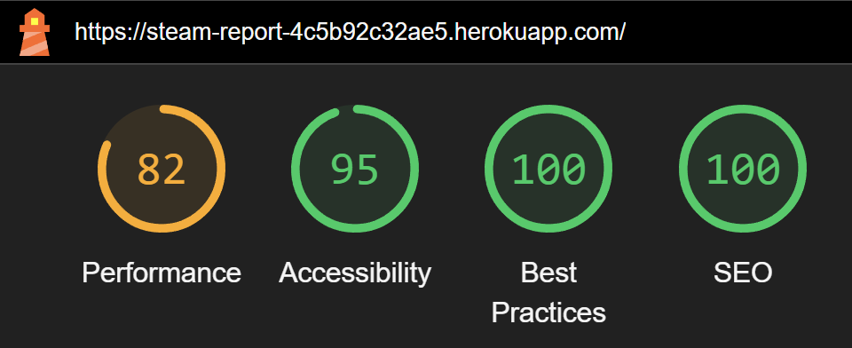 | 
|Timestamp| 14/10/23 |

<details><summary> click here to view suggestions for further improvement</summary>


</details>

[↑ Back to top](#Steam-Report)


***

## 3.3. Browserstack Testing

https://www.browserstack.com/

testing on different browsers: there seems to be an issue with the logo falling above the navigation bar on the home page in Safari/iOS

|Before|After|
|---|---|
||  |

This was fixed by adding a ```3em margin-top``` to the logo, and removing the problematic ```justify-items: center``` from the ```body``` selector.

[↑ Back to top](#Steam-Report)

<div align=center>

## 3.4. Deployment

<b>

[🌐click here to view Deployed Site ](https://steam-report-4c5b92c32ae5.herokuapp.com/)

</b>


</div> 

### 3.4.1. Github 
[Code Institute template](https://github.com/Code-Institute-Org/python-essentials-template) was cloned to create the repository. I cloned repository to my local machine using GitHub Desktop and opened it in VSCode, where I developed the project with the git method.

All libraries and packages were listed in ```requirements.txt```.


### 3.4.2. Heroku

The project was deployed on Heroku. The following steps were taken:

1. Create a new app on Heroku, using app name ```steam-test```, Connect the app to the Github repository, and enable automatic deploys from the main branch.
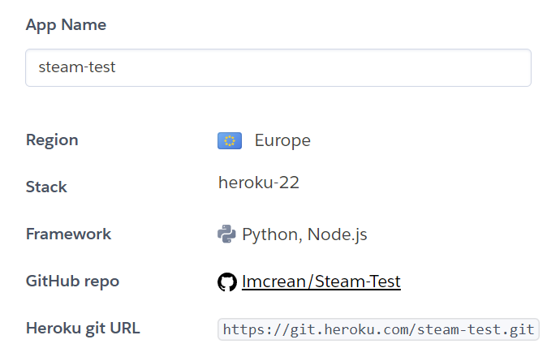

2. Add the following buildpacks in the following order:
    1. heroku/python
    2. heroku/nodejs
    
3. Ensure that Config Vars supported the private key for Google Sheets API (partially hidden elow)
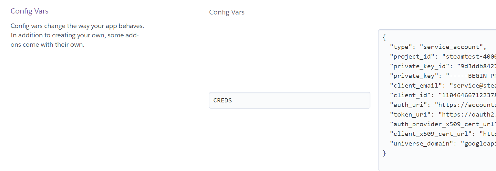


[↑ Back to top](#Steam-Report)

<div align=center>

# 4. Python Issues and Bugs


</div>

## 4.1. Cannot access OpenTrivia DB for Tech, Art and Maths.
<div align=center><details><summary><b> click here to view the issue output</summary></b>


</details></div>

Under "Now on to Art!" and "Now on to Math!" it should reveal the quiz. Should also work for an earlier technology section.

It works for Science and English.

This is likely because the OpenTrivia DB API not active for the specific category.

**Solution: Removed Easy difficulty.**


<div align=center><details><summary><b> click here to view the solution output</summary></b>


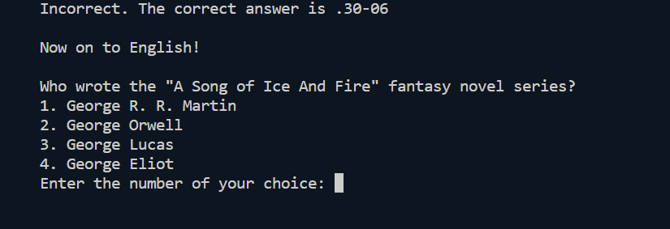


here's the second attempt: we can see that the quiz is shuffling questions,making it exciting for the user.


</details></div>

In long term, best solution would be to migrate to local JSON database, as json files are saved.

## 4.2. Solution abandoned: Issue with Enter key resetting game automatically
<div align=center><details><summary><b> click here to view the issue output</summary></b>


pressing enter resets the game, hence why the player is being asked to enter a number between 1 and 5.
</details></div>


Sources consulted:
- still, Somebody. “Raw_input without Pressing Enter.” Stack Overflow, 19 Aug. 2010, stackoverflow.com/questions/3523174/raw-input-without-pressing-enter. Accessed 28 Sept. 2023.
- “Msvcrt — Useful Routines from the MS VC++ Runtime.” Python Documentation, 2023, docs.python.org/3/library/msvcrt.html#msvcrt.getch. Accessed 28 Sept. 2023.
- “Python String Decode() Method.” Tutorialspoint.com, 2022, www.tutorialspoint.com/python/string_decode.htm. Accessed 28 Sept. 2023.
- Pankaj. “Python ValueError Exception Handling Examples.” Digitalocean.com, DigitalOcean, 3 Aug. 2022, www.digitalocean.com/community/tutorials/python-valueerror-exception-handling-examples. Accessed 28 Sept. 2023.
- “2. Lexical Analysis.” Python Documentation, 2017, docs.python.org/3/reference/lexical_analysis.html#:~:text=Bytes%20literals%20are%20always%20prefixed,must%20be%20expressed%20with%20escapes. Accessed 28 Sept. 2023.


‌Solution: Imported and used ```msvcrt.getch()``` to get input from user without pressing enter.‌ Consulted [Python Documentation](python.org/3/library/msvcrt.html#msvcrt.getch).


‌

<div align=center><details><summary><b> click here to view the solution output</summary></b>

GIF:


</details></div> 

Programme ignores user pressing enter, and responds immediately to user input.

## 4.3. Deployed Heroku does not recognise Windows-only ```msvcrt.getch()``` module from previous issue 4.2. 


Heroku's Linux server does not recognise ```msvcrt.getch()``` module, as it is Windows only.

Tried this solution:
- “Getch()-like Unbuffered Character Reading from Stdin on Both Windows and Unix «Python Recipes «ActiveState Code.” Activestate.com, 2023, code.activestate.com/recipes/134892-getch-like-unbuffered-character-reading-from-stdin/. Accessed 28 Sept. 2023.

‌still did not find getch

‌Solution: Removed ```msvcrt.getch()``` and replaced with ```input()```.‌


<div align=center><details><summary><b> click here to view the solution output</b></summary>


</details></div> 

The code now runs without error on Heroku, and although UX is a little unnessesary, enter key issue is resolved.

## 4.4. Series of Error messages on Heroku after seperating into package files and using from... import... syntax:

These error messages started appearing once ```from import``` language was introduced across packages. This was a particularly challenging issue, as the error messages were numerous and difficult to trace. The issue was always that the code was referencing the wrong file, and the code was not structured correctly. <b>Eventually the code was converted to a single file, and the issue was resolved after carrying the variables through the parameters. As described earlier in the [Structure Plane](#24-structure-plane) section. </b>

<details><summary> click here to view notes on the issue</summary>


```
Running startup command: python3 run.py

Traceback (most recent call last):
  File "/app/run.py", line 10, in <module>
    from package_python import subjectquiz
  File "/app/package_python/subjectquiz.py", line 10, in <module>
    import run
  File "/app/run.py", line 11, in <module>
    from package_python import quizleaderboard
  File "/app/package_python/quizleaderboard.py", line 1, in <module>
    from package_python import finalreport
  File "/app/package_python/finalreport.py", line 1, in <module>
    from package_python import personality
  File "/app/package_python/personality.py", line 10, in <module>
    from prettytable import PrettyTable
ModuleNotFoundError: No module named 'prettytable'
```

**1. used . syntax to reference correct file.**
```python
from package.subjectquiz import subjectQuiz
from package.quizleaderboard import quizleaderboard
```
Output:
```console
You have chosen to begin the test.
we have reached the final report!
Question 1:
I take on responsibilities at work and complete tasks on time. In the future, I could successfully lead a project team and meet all project milestones, feeling accomplished and reliable.
Please enter a number from 1 to 9 (1 = Strongly Disagree, 5 = Neutral, 9 = Strongly Agree): 
```
I'm expecting the code to run the main menu, but it's running the final report. This is because the code is referencing the wrong file.

2. Transferred code from personality.py to run.py


Sources consulted:
“The Import Statements in Python.” Tutorialspoint.com, 2020, www.tutorialspoint.com/the-import-statements-in-python#:~:text=Python%27s%20from%20statement%20lets%20you,from%20fib%20import%20fibonacci. Accessed 7 Oct. 2023.
“Python Packages (with Examples).” Programiz.com, 2023, www.programiz.com/python-programming/package. Accessed 7 Oct. 2023.

‌
4. doesn't transition to next section
‌
solution: removed package and converted to single file on run.py

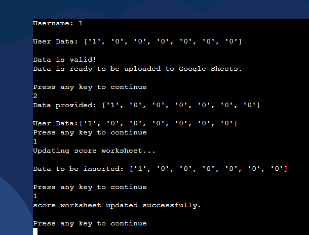


</details>

## 4.5. Heroku Terminal doesn't recognise PrettyTable or termcolor modules.

Although PrettyTable and termcolor modules were recognised in VSCode, they were not recognised in the Heroku terminal. This was solved by using subprocess to install the modules in the Heroku terminal.

Heroku:
```console
Traceback (most recent call last):
  File "/app/run.py", line 12, in <module>
    from prettytable import PrettyTable
ModuleNotFoundError: No module named 'prettytable'
```
Solved with subprocess as demonstrated by David Muller.


```‌python
subprocess.check_call([sys.executable, "-m", "pip", "install", "prettytable"])
```

***

*David Muller. “How to Use Subprocess to Run External Programs in Python 3.” Digitalocean.com, DigitalOcean, 30 July 2020, www.digitalocean.com/community/tutorials/how-to-use-subprocess-to-run-external-programs-in-python-3. Accessed 7 Oct. 2023.*


## 4.6. Tracing Terminal issues on the VSCode terminal:

The following code was used to trace the terminal issues on the VSCode terminal. This was useful for debugging, as it allowed the developer to see the output of the terminal, and to see where the code was breaking.

The solution was for issues with the user_data_string was to use the str() function to convert the integer to a string.

<details>
<summary>click here to see terminal issues</summary>

```python
    trait_scores_Openness_string = str(trait_scores["Openness"])
    trait_scores_Conscientiousness_string = str(
        trait_scores["Conscientiousness"]
    )  # convert the trait_scores["Conscientiousness"] value to a string
    trait_scores_Extraversion_string = str(
        trait_scores["Extraversion"]
    )  # convert the trait_scores["Extraversion"] value to a string
    trait_scores_Agreeableness_string = str(
        trait_scores["Agreeableness"]
    )  # convert the trait_scores["Agreeableness"] value to a string
    trait_scores_Neuroticism_string = str(
        trait_scores["Neuroticism"]
    )  # convert the trait_scores["Neuroticism"] value to a string
    while True:  # loop until valid data is provided
```


```python
Traceback (most recent call last):
  File "/app/run.py", line 841, in <module>
    main()
  File "/app/run.py", line 137, in main
    dataHandling(subject_scores, username_str, trait_scores)
  File "/app/run.py", line 560, in dataHandling
    data_OCEAN = getLocalDataFromUser_OCEAN(trait_scores, username_str)  # call the getLocalDataFromUser_STEAM function and store the returned data in a variable called data
                 ^^^^^^^^^^^^^^^^^^^^^^^^^^^^^^^^^^^^^^^^^^^^^^^^^^^^^^
  File "/app/run.py", line 582, in getLocalDataFromUser_OCEAN
    user_data_string_OCEAN = f"{username_str},{trait_scores['Openness']},{trait_scores['Conscientiousness']},{trait_scores['Extraversion']},{trait_scores['Agreeableness']},{trait_scores['Neuroticism']}"
                                               ~~~~~~~~~~~~^^^^^^^^^^^^
TypeError: string indices must be integers, not 'str'
```

```
Trait Scores in Percentage:
Openness: Invalid score. It should be between 5 and 45.%
Conscientiousness: Invalid score. It should be between 5 and 45.%
Extraversion: Invalid score. It should be between 5 and 45.%
Agreeableness: Invalid score. It should be between 5 and 45.%
Neuroticism: Invalid score. It should be between 5 and 45.%
press any key to continue
```

Error with order
```---------Section: Art---------

--------Question 1 of 10---------

$$$ End of function
Now on to Math!

You have chosen to begin the multiple choice quiz.
What is the derivative of Acceleration with respect to time?
1. Shift
2. Bump
3. Jerk
4. Slide
Enter the number of your choice: 
```

</details>

## 4.7. 4.6 Finding correct parameters for functions

After accumulating the multiple packages in to a run.py, as described in issue 4.4, the developer had to find the correct parameters to carry through the functions. 

This was done by trial and error, and by using the ```print()``` function to see what the code was outputting.

<details>
<summary>click here to see terminal issues</summary>

```
Traceback (most recent call last):
  File "C:\Users\lmcre\OneDrive\Documents\GitHub\Project-3-Working-Title\run.py", line 827, in <module>

    ^
  File "C:\Users\lmcre\OneDrive\Documents\GitHub\Project-3-Working-Title\run.py", line 134, in main
    start_personality_quiz(username_str)
  File "C:\Users\lmcre\OneDrive\Documents\GitHub\Project-3-Working-Title\run.py", line 190, in start_personality_quiz
    start_subject_quiz(username_str, trait_scores)
  File "C:\Users\lmcre\OneDrive\Documents\GitHub\Project-3-Working-Title\run.py", line 196, in start_subject_quiz
    start_data_handling(username_str, trait_scores, subject_scores)
  File "C:\Users\lmcre\OneDrive\Documents\GitHub\Project-3-Working-Title\run.py", line 199, in start_data_handling
    dataHandling(username_str, trait_scores, subject_scores) # Upload the user's data to Google Sheets
    ^^^^^^^^^^^^^^^^^^^^^^^^^^^^^^^^^^^^^^^^^^^^^^^^^^^^^^^^
  File "C:\Users\lmcre\OneDrive\Documents\GitHub\Project-3-Working-Title\run.py", line 536, in dataHandling

  File "C:\Users\lmcre\OneDrive\Documents\GitHub\Project-3-Working-Title\run.py", line 549, in getLocalDataFromUser_STEAM
    data_STEAM = getLocalDataFromUser_STEAM(subject_scores, username_str)  # call the getLocalDataFromUser_STEAM function and store the returned data in a variable called data
                                                   ^^^^^^^^^^^^^^^^^^^^^^^^^
AttributeError: 'str' object has no attribute 'scoreTotal'
```

</details>


[↑ Back to top](#Steam-Report)

<div align=center>


# 5. Credits & Acknowledgements

</div>

## 5.1. Initial Resources Research

In early stages of development, the following python projects were tested and researched to gain an understanding of Python and find inspiration for an original project.

<details><summary><b> click here to view initial research and inspiration </b></summary>
<br><br>

**Python Projects:**
- “Tomdu3/Millionaire-Kindof: CI Project 3 - Who Wants to Be a Millionaire. Kind Of.” GitHub, 18 Mar. 2023, github.com/tomdu3/millionaire-kindof. Accessed 17 Sept. 2023.
  - username with validation check
  - decorated with title displays constantly, ASCII art, fast animations
  - navigation menu including how to play, high scores
  - points guaranteed constantly displays and updates
  - connects to a Google Sheet and updates the high scores
  - uses the Trivia API “The Trivia API | the Internet’s Largest Database of Multiple Choice Quiz Questions.” The-Trivia-Api.com, 2023, the-trivia-api.com/. Accessed 17 Sept. 2023.

- “Rockroman/PP3_The_Coach.” GitHub, 7 Oct. 2022, github.com/rockroman/PP3_The_Coach. Accessed 17 Sept. 2023.
  - presents data as a table after collecting user data
  - calculates a % score based on data

- “Beratzorlu/Python-Quiz: Code Institute Prof. Dip. Full Stack Software Development Portfolio Project 3: A CLI-Based Quiz Game.” GitHub, 2023, github.com/beratzorlu/python-quiz. Accessed 17 Sept. 2023.
  - quiz logic with validation check and a database
  - score logic
  - science question
  - user name with validation check
  - decorated with colors and ASCII art

- “Alexkisielewicz/Home-Library-App: Home Library App Was Created as Portfolio Project #3 (Python Essentials) for Diploma in Full Stack Software Development at Code Institute.” GitHub, 20 Nov. 2022, github.com/alexkisielewicz/home-library-app. Accessed 17 Sept. 2023.
  - advanced CRUD logic 
  - displays tables
  - changes sorting method

- “Jkingportfolio/CI_PP3_Taco_Trailer: Code Institute Full Stack Developer Course - Portfolio Project 3 - Python Essentials.” GitHub, 15 Sept. 2022, github.com/jkingportfolio/CI_PP3_Taco_Trailer. Accessed 17 Sept. 2023.

**Walkthroughs:**
- “Code-Institute-Solutions/Love-Sandwiches-P5-Sourcecode.” GitHub, 25 Mar. 2021, github.com/Code-Institute-Solutions/love-sandwiches-p5-sourcecode. Accessed 17 Sept. 2023. 
  - Shows how to connect to a Google Sheet
  - Creates a formula for calculating the data on different sheets
  - Shows how to deny invalid input
  - How to structure code with Main() function and other functions
  - Experimented with the code to see how python could recognise the data in the Google Sheet, regardless of whether it was a calculated formula or not.
  
  <details><summary>Tested some basic CSS decorations, click here to view</summary>
  
  ```css
    body {
    background-image: url(https://i.ibb.co/fSD71Nb/endless-constellation.png);/*Todo: try hosting the image locally on github*/
    background-size: 300px;
    background-repeat: repeat;
    background-attachment: fixed;
    display: flex;
    justify-content: center;
    align-items: center;
    flex-direction: column;
    height: 100vh;
    }
  ```

  </details>
- Run That. “Quiz App Using API Data - Python Project 💥 Make a Python Quiz App.” YouTube, YouTube Video, 16 May 2023, www.youtube.com/watch?v=kW2f1Hwgals. Accessed 17 Sept. 2023.
  - how to use OpenTriviaDB API

**Personality Quiz Resources**
- “Methodology - Sentino Personality API - Psychology NLP.” Sentino Personality API - Psychology NLP, 2 Oct. 2023, sentino.org/api/methodology/#2-1-golden-data-set. Accessed 5 Oct. 2023.
- Real Python. “Build a Quiz Application with Python.” Realpython.com, Real Python, 8 June 2022, realpython.com/python-quiz-application/#step-1-ask-questions. Accessed 5 Oct. 2023.
- Guest. “The Myers Test - PDFCOFFEE.COM.” Pdfcoffee.com, PDFCOFFEE.COM, 2021, pdfcoffee.com/the-myers-test-pdf-free.html. Accessed 5 Oct. 2023.
- 
‌
‌

**Python Libraries**

- “Prettytable.” PyPI, 11 Sept. 2023, pypi.org/project/prettytable/. Accessed 21 Sept. 2023.
- “Colorama.” PyPI, 25 Oct. 2022, pypi.org/project/colorama/. Accessed 21 Sept. 2023.

‌
**Automatic Testing Resources**
- “CI Python Linter.” Herokuapp.com, 2023, pep8ci.herokuapp.com/. Accessed 21 Sept. 2023.

**Databases**
- “Open Trivia DB.” Opentdb.com, 2023, opentdb.com/. Accessed 17 Sept. 2023.
  - this is the API used in the walkthrough above
  - it has a lot of categories and questions
- “The Trivia API | the Internet’s Largest Database of Multiple Choice Quiz Questions.” The-Trivia-Api.com, 2023, the-trivia-api.com/. Accessed 17 Sept. 2023.
- Personal Marksheet Database. Accessed 21 Sept 2023.
  - this is a database that I created at a previous school to calculate student data. The feedback updates according to the data entered, assuming and identifying the most urgent areas to improve.
  - The subject matter of an Art Test is a little problematic undermines cultural enrichment aspect of the subject. 
  - Contains "Free School Meals", Special Needs and English as an Additional Language Data which is useful.
  - Could it be resummarised as a more objective test?
  - Could it be an essential prompt that the success criteria is defined by the user with 6 criteria? Then use the existing data as dummy data. Then allow the user to create their own data.


**Surface Design**
- “Create ASCII Text Banners Online.” Manytools.org - Your Online Toolshed, 2022, manytools.org/hacker-tools/ascii-banner/. Accessed 17 Sept. 2023.

**Other**
- nevsky.programming. “Top 5 Most Useful Python Libraries #Shorts.” YouTube, YouTube Video, 29 July 2021, www.youtube.com/shorts/1hFq8EdQpqM. Accessed 21 Sept. 2023.
- “Code Institute Curriculum.” Codeinstitute.net, 2023, learn.codeinstitute.net/ci_program/diplomainfullstacksoftwarecommoncurriculum. Accessed 21 Sept. 2023. Available to students only.

‌

‌</details>

## 5.2. Code snippets from Love Sandwiches and Quiz App walkthroughs.

Two key walkthrough's were consulted to develop the code. The first was the Love Sandwiches project.

**“Code-Institute-Solutions/Love-Sandwiches-P5-Sourcecode.” GitHub, 25 Mar. 2021, github.com/Code-Institute-Solutions/love-sandwiches-p5-sourcecode. Accessed 17 Sept. 2023.** 

  - Shows how to connect to a Google Sheet
  - Creates a formula for calculating the data on different sheets
  - Shows how to deny invalid input
  - How to structure code with Main() function and other functions
  - Experimented with the code to see how python could recognise the data in the Google Sheet, regardless of whether it was a calculated formula or not.


The second was this quiz app walkthrough,

**Run That. “Quiz App Using API Data - Python Project 💥 Make a Python Quiz App.” YouTube, YouTube Video, 16 May 2023, www.youtube.com/watch?v=kW2f1Hwgals. Accessed 17 Sept. 2023.**

- formed the base of the STEM subject quiz
- how to use OpenTriviaDB API
- how to track questions answered and score
- once confidence was deveoped, the personality quiz provided a much looser interpetation of what was learnt.

[↑ Back to top](#Steam-Report)


## 5.3. Technologies Used

**Languages**
- [Python](https://www.python.org/) was used as the backend programming language
- [JSON](https://www.json.org/json-en.html) was used to store the data for the personality quiz and final report.

**Python Modules**

- [OAuth2](https://oauth.net/2/) was used to connect to Google Sheets API
- [gspread](https://docs.gspread.org/en/latest/) was used to connect to Google Sheets API
- [prettytable](https://pypi.org/project/prettytable/) was used to display the data in a table
- [termcolor](https://pypi.org/project/termcolor/) was used to display the data in color
- [json](https://docs.python.org/3/library/json.html) was used to store the data for the personality quiz and final report.
- [os](https://docs.python.org/3/library/os.html) and [sys](https://docs.python.org/3/library/sys.html) was used to clear the terminal
- [subprocess](https://docs.python.org/3/library/subprocess.html) was used to install the prettytable and termcolor modules in the Heroku terminal
- [html](https://docs.python.org/3/library/html.html) was used to convert the HTML entities in the OpenTriviaDB API to text
- [random](https://docs.python.org/3/library/random.html) was used to shuffle the questions in the STEM subject quiz
- [requests](https://docs.python-requests.org/en/latest/) was used to connect to the OpenTriviaDB API

**APIS**
- [OpenTriviaDB](https://opentdb.com/) was used for the STEM subject quiz
- [Google Sheets API](https://developers.google.com/sheets/api) was used to store the data for the personality quiz and subject quiz.

**Programming Software**
- [VSCode](https://code.visualstudio.com/) was used as my code editor
- [Gitpod](https://www.gitpod.io/) was used as my secondary code editor
- [Github](https://www.github.com/) was used for Version control

**Tools**
- [browserstack](https://www.browserstack.com/) was used for checking website on firefox, opera, edge, safari and chrome
- [Python Tutor](https://www.pythontutor.com) was used for debugging the Javascript, as well as a research tool early on in the project to understand the flow of the code.
- [Fancy Screen](http://fancyapps.com/) by Janis Skarnelis was used to document GIFs and videos of the project


[↑ Back to top](#Steam-Report)

***

## 5.4. Libraries Used

**Programming Libraries**

The following documentation isreferenced in the code. 
- “Json.load in Python.” GeeksforGeeks, GeeksforGeeks, 12 Mar. 2020,
www.geeksforgeeks.org/json-load-in-python/. Accessed 5 Oct. 2023.
- “Python Dictionary get() Method.” W3Schools, www.w3schools.com/python/ref_dictionary_get.asp. Accessed 8 Oct. 2023.
- “Sort a List of Objects in Python | FavTutor.” FavTutor, 2022,favtutor.com/blogs/sort-list-of-objects-python. Accessed 5 Oct. 2023.
- “How to Sort a List of Dictionaries by a Value of the Dictionary in Python?” Stack Overflow, 2023, stackoverflow.com/questions/72899/
- “Python Round() Function.”, W3schools.com, 2023, www.w3schools.com/python/ref_func_round.asp.Accessed 5 Oct. 2023.
- “Python Function Arguments.” W3schools.com, 2023, www.w3schools.com/python/gloss_python_function_arguments. asp#:~:text=A%20parameter%20is%20the%20variablefunction%20when%20it%20is%20called. Accessed 5 Oct. 2023.
- “Python Increment and Decrement Operators.” W3schools.com, 2023, www.w3schools.com/python/python_operators.asp. Accessed 5 Oct. 2023.
- “Python Len() Function.” W3schools.com, 2023, www.w3schools.com/python/ref_func_len.asp.
- “Python Random Shuffle() Method.” W3schools.com, 2023, www.w3schools.com/python/ref_random_shuffle.asp.

**Media libraries**
- [canva](https://www.canva.com/) was used for the vector graphics in the Readme, the logo and favicon
- [bgjar](https://bgjar.com/) was used for the background image in the Readme

**JSON database placeholders via AI Large Language Models**
- [GPT-4](https://www.openai.com/blog/openai-api/) by OpenAI was specifically used to generate the JSON personality quiz and personality report, as a placeholder for content that would ideally be chartered by a professional psychologist.

**documentation**
- [shields.io](https://shields.io/) was used for Documentation Badges


## 5.5. Acknowledgements

Thank you to my mentor, Oluwaseun Owonikoko for providing me with helpful feedback and guidance throughout the project, especially with using a class to store the data for the personality quiz.

Thank you to my family and friends for their support and encouragement throughout the project. Especially to my Mum who tested the deployed project first and helped me spot a small bug with the personality quiz asking an extra question.

[↑ Back to top](#Steam-Report)

<div align=center><br><br></div>

</div>
