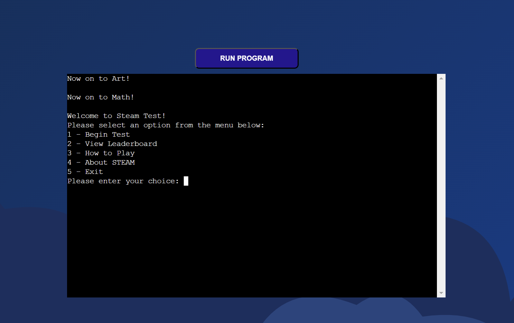
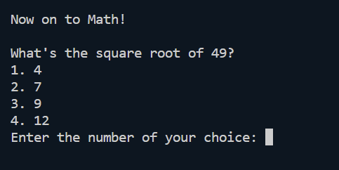
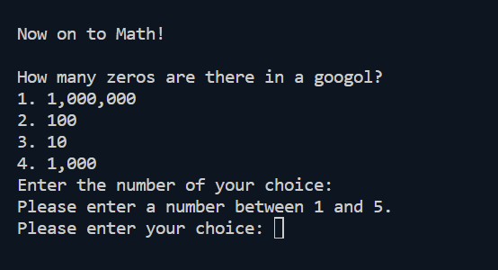

# Python Issues and Bugs<!-- omit in toc -->

## Table of Contents<!-- omit in toc -->
- [1. Code Structure Issues](#1-code-structure-issues)
  - [1.1 Cannot access OpenTrivia DB for Tech, Art and Maths.](#11-cannot-access-opentrivia-db-for-tech-art-and-maths)

# 1. Code Structure Issues

## 1.1 Cannot access OpenTrivia DB for Tech, Art and Maths.

<b> click here to view the issue output
</b>

Under "Now on to Art!" and "Now on to Math!" it should reveal the quiz. Should also work for an earlier technology section.

It works for Science and English.

This is likely because the OpenTrivia DB API not active for the specific category.

Removed Easy difficulty.

<b> click here to view the solution output
</b>

here's the second attempt: we can see that the quiz is shuffling questions,making it exciting for the user.

In long term, best solution would be to migrate to local JSON database, as json files are saved.
