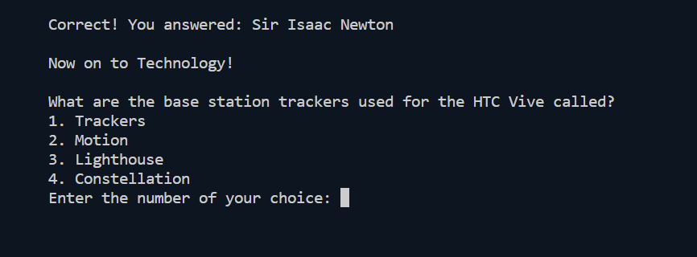
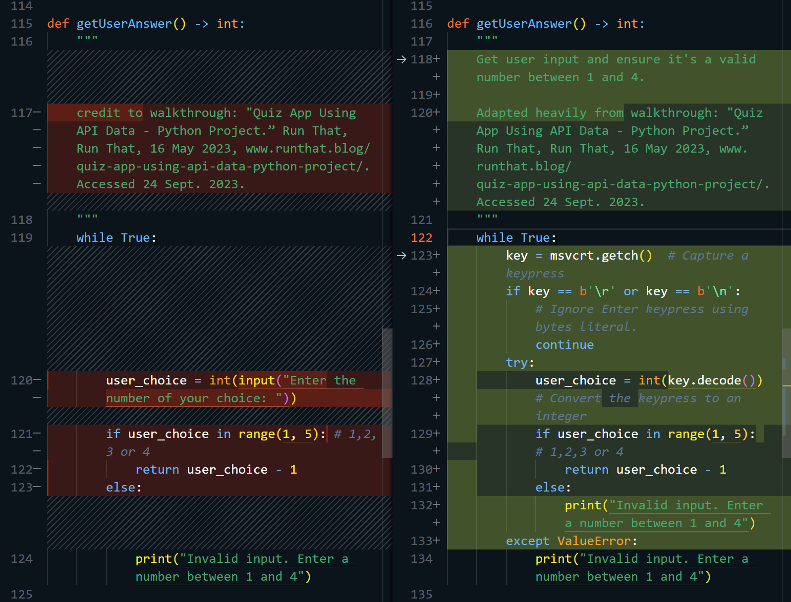

<div align="center">


# Python Issues and Bugs<!-- omit in toc -->

</div>

## Table of Contents<!-- omit in toc -->
- [1. Cannot access OpenTrivia DB for Tech, Art and Maths.](#1-cannot-access-opentrivia-db-for-tech-art-and-maths)
- [2. Issue with Enter key resetting game automatically](#2-issue-with-enter-key-resetting-game-automatically)
- [3. Deployed Heroku does not recognise Windows-only ```msvcrt.getch()``` module from issue 2.](#3-deployed-heroku-does-not-recognise-windows-only-msvcrtgetch-module-from-issue-2)


# 1. Cannot access OpenTrivia DB for Tech, Art and Maths.
<div align=center><details><summary><b> click here to view the issue output</summary></b>


</details></div>

Under "Now on to Art!" and "Now on to Math!" it should reveal the quiz. Should also work for an earlier technology section.

It works for Science and English.

This is likely because the OpenTrivia DB API not active for the specific category.

**Solution: Removed Easy difficulty.**


<div align=center><details><summary><b> click here to view the solution output</summary></b>




here's the second attempt: we can see that the quiz is shuffling questions,making it exciting for the user.


</details></div>

In long term, best solution would be to migrate to local JSON database, as json files are saved.

# 2. Issue with Enter key resetting game automatically
<div align=center><details><summary><b> click here to view the issue output</summary></b>


pressing enter resets the game, hence why the player is being asked to enter a number between 1 and 5.
</details></div>


Sources consulted:
- still, Somebody. “Raw_input without Pressing Enter.” Stack Overflow, 19 Aug. 2010, stackoverflow.com/questions/3523174/raw-input-without-pressing-enter. Accessed 28 Sept. 2023.
- “Msvcrt — Useful Routines from the MS VC++ Runtime.” Python Documentation, 2023, docs.python.org/3/library/msvcrt.html#msvcrt.getch. Accessed 28 Sept. 2023.
- “Python String Decode() Method.” Tutorialspoint.com, 2022, www.tutorialspoint.com/python/string_decode.htm. Accessed 28 Sept. 2023.
- Pankaj. “Python ValueError Exception Handling Examples.” Digitalocean.com, DigitalOcean, 3 Aug. 2022, www.digitalocean.com/community/tutorials/python-valueerror-exception-handling-examples. Accessed 28 Sept. 2023.
- “2. Lexical Analysis.” Python Documentation, 2017, docs.python.org/3/reference/lexical_analysis.html#:~:text=Bytes%20literals%20are%20always%20prefixed,must%20be%20expressed%20with%20escapes. Accessed 28 Sept. 2023.


‌Solution: Imported and used ```msvcrt.getch()``` to get input from user without pressing enter.‌ Consulted [Python Documentation](python.org/3/library/msvcrt.html#msvcrt.getch).


‌

<div align=center><details><summary><b> click here to view the solution output</summary></b>

GIF:


</details></div> 

Programme ignores user pressing enter, and responds immediately to user input.

# 3. Deployed Heroku does not recognise Windows-only ```msvcrt.getch()``` module from issue 2. 


likely

Tried this solution:
- “Getch()-like Unbuffered Character Reading from Stdin on Both Windows and Unix «Python Recipes «ActiveState Code.” Activestate.com, 2023, code.activestate.com/recipes/134892-getch-like-unbuffered-character-reading-from-stdin/. Accessed 28 Sept. 2023.

‌still did not find getch

‌Solution: Removed ```msvcrt.getch()``` and replaced with ```input()```.‌


<div align=center><details><summary><b> click here to view the solution output</b></summary>


</details></div> 

The code now runs without error on Heroku, and although UX is a little unnessesary, enter key issue is resolved.